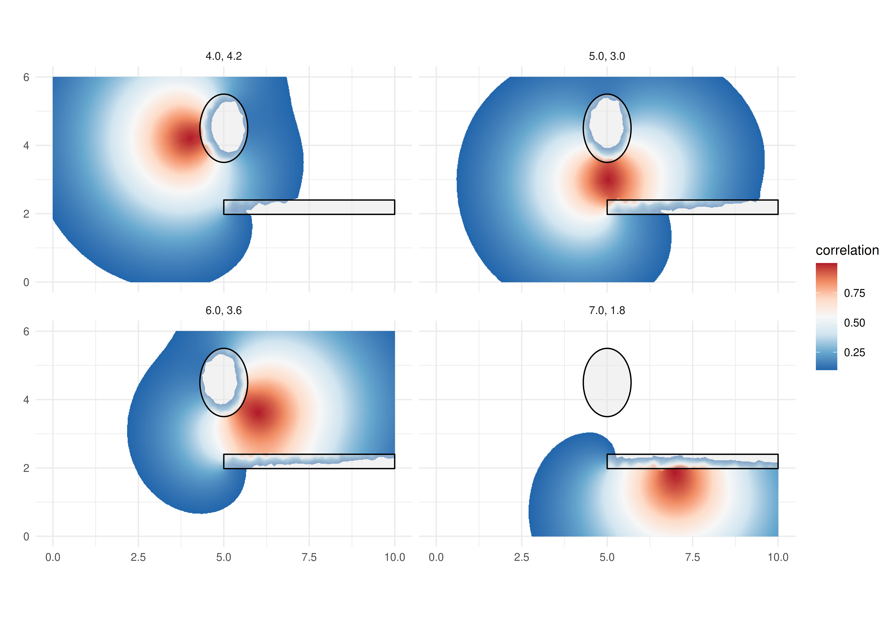
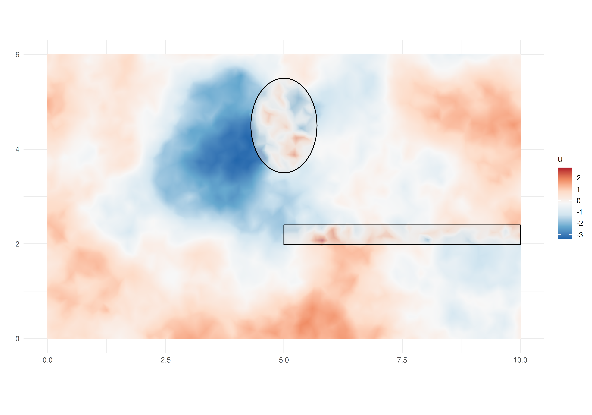

# A barrier model illustration

## Abstract

In this tutorial we illustrate a new implementation of the model
proposed in Bakka et al. (2019). It consider the problem of modeling
over a spatial domain accounting for physical barriers. The original
implementation is illustrated in [this
tutorial](https://haakonbakkagit.github.io/btopic128.html). The
re-implementation consider a new (faster) computational method available
in the **INLA** package. See details at the end of this vignette to
update old working code to use this new implementation.

## Introduction

Suppose that there is a phenomena that varies over a spatial domain.
Models usually consider correlation between observations made.
Considering a pair of observations, the correlation is usually specified
as a function of the distance between the location sites from where
these observations were collected. If there is a barrier in the spatial
domain, this correlation for a pair of observations taken from sites in
different sides of the barrier shall consider the barrier. In resume, it
should no longer be just a function of the distance. Basically, the
correlation between points in two different sides of the barrier should
decay faster (than the usual) to zero and “does not cross the domain”.

In order to illustrate the problem, let us define a rectangle as our
spatial domain:

``` r
rxy <- c(10, 6)
r <- mean(rxy)
bb <- rbind(
    c(0, 1)*rxy[1],
    c(0, 1)*rxy[2])
domain.xy <- cbind(
    c(0, 1, 1, 0, 0) * rxy[1],
    c(0, 0, 1, 1, 0) * rxy[2])
```

We will now set the barrier as the two polygons defined as follows

``` r
barrier1 <- cbind(
  cos(seq(0, 2*pi, length=50)) * 0.7 + 0.50 * rxy[1], 
  sin(seq(0, 2*pi, length=50)) * 1.0 + 0.75 * rxy[2])
barrier2 <- cbind(
  c(0.50, 1.50, 1.50, 0.50, 0.50) * rxy[1],
  c(0.33, 0.33, 0.40, 0.40, 0.33) * rxy[2])
```

Define the objects using the package:

``` r
library(sf)
#> Linking to GEOS 3.12.1, GDAL 3.8.4, PROJ 9.4.0; sf_use_s2() is TRUE
domain <- st_sfc(st_polygon(list(domain.xy)))
barriers <- st_sfc(st_multipolygon(
  list(st_polygon(list(barrier1)), 
       st_polygon(list(barrier2)))))
```

We can visualize these polygons in order to make the problem clear:

``` r
library(ggplot2)
gg0 <- ggplot() + 
  xlab("") + ylab("") +
  theme_minimal() + coord_fixed()
gg0 + xlim(bb[1, ]) +
  geom_sf(data = domain, fill = "blue") +
  geom_sf(data = barriers, fill = "gray")
#> Coordinate system already present.
#> ℹ Adding new coordinate system, which will replace the existing one.
```


The problem is to model data in both sides of the barrier considering
that the correlation between then should account for the barrier. The
proposed method in Bakka et al. (2019) models the entire domain,
including the barrier. To deal with the barrier, the correlation range
is set to be reasonable shorter over the barrier domain than the one at
the domain of interest. This idea is simple and does not add any
parameter in the usual stationary model. Furthermore, it can be
implemented with any inferential method.

In Bakka et al. (2019), the proposed method consider the Stochastic
Partial Differential Equations - SPDE approach proposed in Lindgren,
Rue, and Lindström (2011). The implementation illustrated in [this
tutorial](https://haakonbakkagit.github.io/btopic128.html) deals with a
discretization of the domain. The discretization should be considered
with some care. The fraction fixed for the analysis interplay with the
width of the barrier. One should choose a small enough fraction, see
details in Bakka et al. (2019).

We first load the other packages that will be used in this tutorial.

``` r
library(INLA)
#> Loading required package: Matrix
#> This is INLA_25.11.22 built 2025-11-22 08:57:21 UTC.
#>  - See www.r-inla.org/contact-us for how to get help.
#>  - List available models/likelihoods/etc with inla.list.models()
#>  - Use inla.doc(<NAME>) to access documentation
library(INLAspacetime)
#> Loading required package: fmesher
#> Loading required package: INLAtools
#> Loading required package: inlabru
#> see more at https://eliaskrainski.github.io/INLAspacetime
library(inlabru)
library(patchwork)
library(fmesher)
```

## Model definition and discretization

Let us consider that there is an underlying random field over the
specified domain. This random field will be discretized using the mesh
so that a precision matrix is defined for the distribution at the mesh
nodes. We will define the barrier model as proposed in Bakka et al.
(2019) which make use of a triangulation.

## Mesh and triangles

The solution consider a discretization of the spatial domain and the
simplest one is using triangles. Therefore we start with the following
mesh made up of small triangles in the domain and bigger around it.

``` r
mesh <- fm_mesh_2d(
    loc.domain = domain.xy, 
    max.edge = c(0.03, 0.1) * r,
    offset = c(0.1, 0.3) * r,
    cutoff = 0.01 * r)
mesh$n
#> [1] 4364
```

The solution needs the triangles inside the barrier domain to be
identified. For each triangle center we check if it is inside or not of
the barrier domain and and create a vector to identify to which domain
is each triangle center inside

``` r
triBarrier <- unlist(fm_contains(
  x = barriers, 
  y = mesh, 
  type = "centroid"))
```

We can visualize the mesh and color the triangle centers using the
**ggplot** methods from the **inlabru** package

``` r
triCenters.xy <- cbind(
  mesh$loc[mesh$graph$tv[,1], 1:2] +
  mesh$loc[mesh$graph$tv[,2], 1:2] +
  mesh$loc[mesh$graph$tv[,3], 1:2])/3
gg0 + 
    gg(mesh) +
    geom_point(aes(
        x = triCenters.xy[triBarrier, 1],
        y = triCenters.xy[triBarrier, 2])) 
```


Notice that the mesh goes beyond the domain area including a boundary
extension. Then we also had defined the barrier so that it is also
defined in this boundary. Therefore, when building the model over this
discretization, the barrier will be well defined and the behavior of the
process will be as intended.

### Precision matrix

The parameters in this model are the range and the marginal variance, We
also define the range parameter in the barrier so that the method works.
We consider the range for the barrier as a fraction of the range over
the domain. We just use half of the average rectangle edges as the range
in the domain and 10% of it in the barrier.

``` r
sigma <- 1
(ranges <- r * c(0.5, 0.05)) 
#> [1] 4.0 0.4
```

We now have to compute the Finite Element matrices needed for the model
discretization, as detailed in Bakka et al. (2019).

``` r
bfem <- mesh2fem.barrier(mesh, triBarrier)
```

We now build the precision matrix with

``` r
Q <- inla.barrier.q(bfem, ranges = ranges, sigma = sigma)
```

### Correlation

We can use the discretized model to compute correlation between pairs of
points in order to check the properties of the model. Let us define a
function that computes the correlation from a given set of location to
each mesh node location.

``` r
localCorrel <- function(locs, mesh, Q) {
  nl <- nrow(locs)
  ii <- sapply(1:nl, function(i)
    which.min(rowSums(sweep(
      mesh$loc[, 1:ncol(locs)], 2, locs[i, ], "-")^2)))
  b <- matrix(0, nrow(Q), nl)
  for(i in 1:nl)
    b[ii[i], i] <- 1
  cc <- inla.qsolve(Q, b)
  s <- sqrt(diag(inla.qinv(Q)))
  for(i in 1:nl)
    cc[, i] <- cc[, i] / (s * s[ii[i]])
  return(drop(cc))
}
```

Consider a set of locations and compute the correlations with

``` r
locs <- cbind(c(0.4, 0.6, 0.7, 0.5) * rxy[1], 
              c(0.7, 0.6, 0.3, 0.5) * rxy[2])
mcorrels <- localCorrel(locs, mesh, Q)
dim(mcorrels) 
#> [1] 4364    4
```

We have the correlation from each mesh node to each of the specified
locations. We would like to visualize it as an image so that we have
these correlation from the location to “everywhere”. Let us build a
projector to project any vector from the mesh nodes to a fine grid and
projected with

``` r
pgrid <- fm_evaluator(
  mesh,
  lattice = fm_evaluator_lattice(
    mesh,
    xlim = bb[1, ],
    ylim = bb[2, ],
    dims = round(500 * rxy/r)
  )
)
gcorrels <- as.matrix(fm_evaluate(
  pgrid, field = mcorrels
))
```

We can now create a `data.frame` with the expanded coordinates of the
pixels

``` r
grid.df <- data.frame(
  x = rep(pgrid$x, times = length(pgrid$y)), 
  y = rep(pgrid$y, each = length(pgrid$x)))
```

The correlations can be projected and prepared for plotting with

``` r
ggcorrels <- do.call(
  rbind, 
  lapply(1:4, function(l) 
    data.frame(grid.df, 
               loc = paste(sprintf("%1.1f", locs[l, 1]), 
                           sprintf("%1.1f", locs[l, 2]), sep = ", "), 
               correlation = gcorrels[, l])))
```

In order to help the visualization of correlations, we will dropped the
pixels with small correlations, less than $0.1$. We can now visualize
the images with

``` r
gg0 + 
  geom_raster(
    data = ggcorrels[ggcorrels$correlation>0.1, ], 
    mapping = aes(x = x, y = y, fill = correlation)) + 
  facet_wrap(~ loc) + 
  add.b0 + gg.add ## look to the appendix for the code for this
```



Notice that the model is also defined in the barrier domain. Therefore
we can do computations at the barrier. We visualized the correlation
over the barriers as well, and added the barrier borders, so that we can
see the action of the short spatial range over the barriers. This visual
inspection helps to verify if the short range over the barrier domain
was set small enough.

## Data simulation

We consider that the random field is observed with noise. We first
sample from the random field distribution.

### A random field sample

There are several algorithms to sample from a random field specified
over a continuous domain without barriers. We will use the already
defined precision matrix to draw a sample at the mesh nodes with

``` r
u <- inla.qsample(1, Q, seed = 1)[,1]
#> Warning in inla.qsample(1, Q, seed = 1): Since 'seed!=0', parallel model is
#> disabled and serial model is selected
```

These values sampled at the mesh nodes can be projected to a set of
small pixels for visualization purpose with

``` r
ugrid.sim <- fm_evaluate(pgrid, field = u)
```

We can now visualize the projected simulated values at the small pixels,
inclusive those values in the barriers.

``` r
grid.df$u <- as.vector(ugrid.sim)
gg0 + 
  geom_raster(
    data = grid.df, 
    aes(x = x, y = y, fill = u)) + 
  add.b0 + gg.add ## look to the appendix for the code for this
```



The visualization of the simulated process over the barrier allows a
visual inspection of the model property. The process in different sides
of the barriers seen to be independent, as illustrated by the
correlation plots.

### Sampling a set of observations

We define a initial set of locations to consider that we observe the
field at these locations. We start with a set of locations chosen
completely at random in the rectangle domain, including a barrier part

``` r
n0 <- 500
set.seed(2)
xy0 <- cbind(
  runif(n0, bb[1, 1], bb[1, 2]),
  runif(n0, bb[2, 1], bb[2, 2]))
```

Then we check which of these is inside the barrier

``` r
ii <- which(sapply(st_intersects(
  x = st_as_sf(data.frame(x=xy0[, 1], y = xy0[, 2]), coords = c('x', 'y')),
  y = barriers), length)==0)
```

The locations to form the data consider only the locations in the
desired domain and outside the barrier

``` r
dataset <- data.frame(
  x = xy0[ii, 1], y = xy0[ii, 2])
(n <- nrow(dataset))
#> [1] 464
```

To simulate the outcome, we project the field to these locations, add an
intercept and some random noise

``` r
sigma.e <- 1
set.seed(3)
dataset$outcome <- 
    drop(fm_evaluate(
        mesh,
        loc = cbind(dataset$x, dataset$y),
        field = u)) + 
  10 + rnorm(n, 0.0, sigma.e)
```

## Model fitting

Here we illustrate the use of the function in **INLAspacetime** to
implement the barrier model as in Bakka et al. (2019). This
implementation consider the `cgeneric` computational method that is
useful to implement new models with **INLA**. This method allows the
computations in **INLA** to take full advantage of parallel
computations, achieving shorter computation time than with the original
implementation.

We define the model object with

``` r
bmodel <- barrierModel.define(
    mesh = mesh, 
    barrier.triangles = triBarrier,
    prior.range = c(1, 0.01), ## P(range < 1) = 0.01
    prior.sigma = c(1, 0.01), ## P(sigma > 1) = 0.01
    range.fraction = 0.1)
```

We use the model formula in the **inlabru** way, where the `field` will
be the name for the spatial effect:

``` r
model <- outcome ~ Intercept(1) +
    field(cbind(x, y), model = bmodel)
```

The **inlabru** main function can be supplied with only the model
formula, the data and the family, as follows

``` r
result <- bru(
    model, dataset, family = "gaussian")
```

## Results

We can see the summary for the posterior marginal distribution for the
intercept with

``` r
result$summary.fix
#>               mean        sd 0.025quant 0.5quant 0.975quant     mode
#> Intercept 10.11302 0.4112101   9.304148 10.10419   10.97202 10.10514
#>                    kld
#> Intercept 1.107568e-06
```

For the hyper-parameters the computations were performed in an internal
scale. That is log of range and log($\sigma$), and
$\log\left( 1/\sigma_{e}^{2} \right)$. However, we can transform each of
the hyper-parameters from the internal marginal scale to its scale with

``` r
pmarginals <- 
    list(
        data.frame(
            param = "sigma.e",
            inla.tmarginal(
                function(x) exp(-x/2),
                result$internal.marginals.hyperpar[[1]])),
        data.frame(
            param = "range",
            inla.tmarginal(
                function(x) exp(x),
                result$internal.marginals.hyperpar[[2]])),
        data.frame(
            param = "sigma",
            inla.tmarginal(
                function(x) exp(x),
                result$internal.marginals.hyperpar[[3]]))
    )
```

From these transformed posterior marginal distributions we can extract a
summary to compare with the values used to sample the data:

``` r
rbind(true = c(sigma.e = sigma.e, range = ranges[1], sigma = 1),
      sapply(pmarginals, function(m)
             unlist(inla.zmarginal(m[, -1], TRUE))[1:2]))
#>         sigma.e    range     sigma
#> true 1.00000000 4.000000 1.0000000
#> mean 1.04429472 4.049527 0.9015846
#> sd   0.03813067 1.100007 0.1406692
```

We can also visualize these these posterior marginal distributions with

``` r
ggplot(do.call(rbind, pmarginals)) + 
    geom_line(aes(x=x, y=y)) + 
    facet_wrap(~param, scales = "free") +
    theme_minimal()
```


#### The fitted field

We can visualize summaries from the fitted field. The posterior mean and
the standard deviation can be projected into small pixels and added to
the raster data with

``` r
grid.df$u.mean <- as.vector(
  fm_evaluate(
    pgrid,
    result$summary.random$field$mean))
grid.df$u.sd <- as.vector(
  fm_evaluate(
    pgrid,
    result$summary.random$field$sd))
```

To help the visualization, we will filter the grid pixels considering
the barriers.

``` r
gInBarrier <- which(sapply(st_intersects(
  x = st_as_sf(grid.df, coords = c('x', 'y')),
  y = barriers), length)==0)
```

We can now visualize the posterior mean with

``` r
gg0 + 
  geom_raster(
    data = grid.df[!gInBarrier, ], 
    aes(x = x, y = y, fill = u.mean)) + 
  gg.add ## look to the appendix for the code for this
```


The estimated field, considering the posterior mean shown, exhibits a
different pattern in each side of the barrier, particularly far from its
tip. Therefore we successfully accounted for the barrier in the model.
See [this tutorial](https://haakonbakkagit.github.io/btopic128.html) for
details and how to visualize the implied correlation between two points.

Similarly, we can plot the posterior standard deviation of the field,
and the data locations used to estimate the model. This has lower values
around more densely sampled locations and higher values otherwise. The
highest are near the boundaries, including the boundary at the barriers,
and far from observed locations.

``` r
gg0 + 
  geom_raster(
    data = grid.df[!gInBarrier, ], 
    aes(x = x, y = y, fill = u.sd)) + 
  geom_point(data = dataset, aes(x = x, y = y)) +
  gg.add ## look to the appendix for the code for this
```


## Appendix A: adapting old code

To adapt code based in [this
tutorial](https://haakonbakkagit.github.io/btopic128.html), one should
consider that there are two new functions implemented, as detailed
bellow:

| Old                     | New                   |
|:------------------------|:----------------------|
| inla.barrier.fem()      | mesh2fem.barrier()    |
| inla.barrier.pcmatern() | barrierModel.define() |

The arguments in the new functions have the same names as in the old
ones. The new function used to define the model has additional
arguments. See the help of this function for details.

## Appendix B: ggplot reused code

The additional **ggplot2** code used

``` r
gg.add <- list(
  scale_fill_distiller(
    type = "div", 
    palette = "RdBu", 
    na.value = "transparent")
)
add.b0 <- list(
  geom_polygon(
    mapping = aes(x, y), 
    data = data.frame(
      x = pmin(barrier1[,1], bb[1, 2]), 
      y = pmin(barrier1[,2], bb[2, 2])
    ), colour = "black", 
  fill = gray(0.9, 0.5)), ##"transparent"),
  geom_polygon(
    mapping = aes(x, y), 
    data = data.frame(
      x = pmin(barrier2[,1], bb[1, 2]), 
      y = pmin(barrier2[,2], bb[2, 2]) 
    ), colour = "black", 
    fill = gray(0.9, 0.5))##"transparent")
)
```

## References

Bakka, H., J. Vanhatalo, J. Illian, D. Simpson, and H. Rue. 2019.
“Non-Stationary Gaussian Models with Physical Barriers.” *Spatial
Statistics* 29 (March): 268–88.
https://doi.org/<https://doi.org/10.1016/j.spasta.2019.01.002>.

Lindgren, Finn, Håvard Rue, and Johan Lindström. 2011. “An Explicit Link
Between Gaussian Fields and Gaussian Markov Random Fields: The
Stochastic Partial Differential Equation Approach.” *Journal of the
Royal Statistical Society: Series B (Statistical Methodology)* 73 (4):
423–98. <https://doi.org/10.1111/j.1467-9868.2011.00777.x>.
