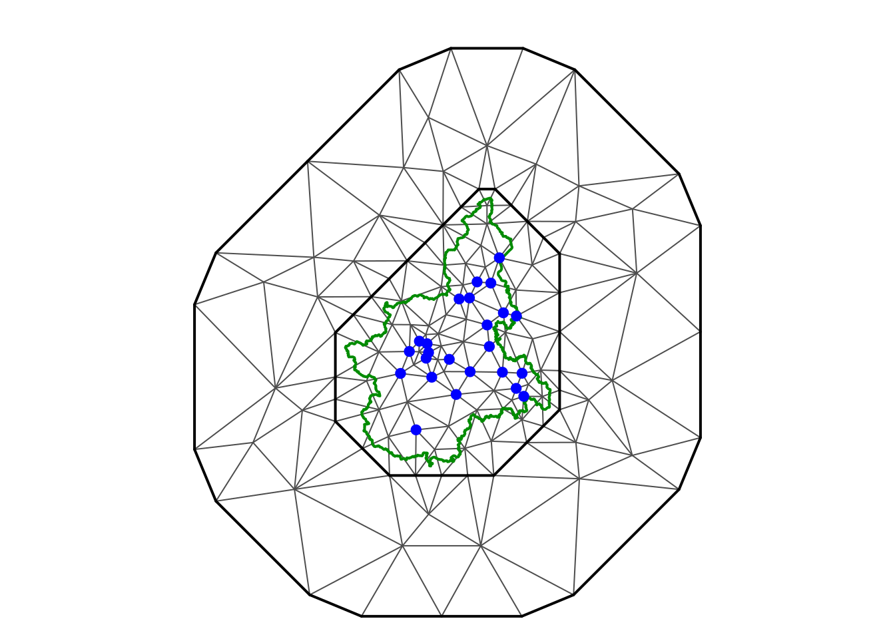
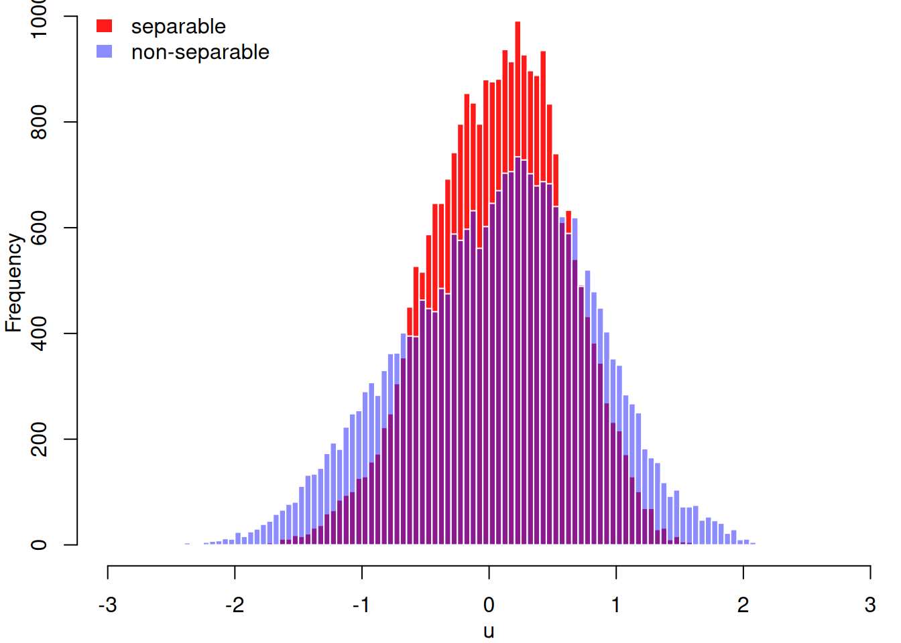

# The Piemonte dataset example

## Abstract

In this vignette we illustrate how to fit some of the spacetime models
in Lindgren et al. (2024), see \[[SORT vol. 48, no. 1,
pp. 3-66](https://raco.cat/index.php/SORT/article/view/428665)\] and the
related code, for the data analysed in Cameletti et al. (2013). To
perform this we will use the Bayesian paradigm with the**INLA** package,
using the features provided by the **inlabru** package to facilitate the
coding.

## Introduction

### The packages and setup

We start loading the required packages and those for doing the
visualizations, the **ggplot2** and **patchwork** packages.

``` r
library(ggplot2)
library(patchwork)
library(INLA)
#> Loading required package: Matrix
#> This is INLA_25.11.22 built 2025-11-22 08:57:21 UTC.
#>  - See www.r-inla.org/contact-us for how to get help.
#>  - List available models/likelihoods/etc with inla.list.models()
#>  - Use inla.doc(<NAME>) to access documentation
library(INLAspacetime)
#> Loading required package: fmesher
#> Loading required package: INLAtools
#> Loading required package: inlabru
#> see more at https://eliaskrainski.github.io/INLAspacetime
library(inlabru)
library(fmesher)
```

We will ask it to return the WAIC, DIC and CPO

``` r
ctrc <- list(
  waic = TRUE,
  dic = TRUE,
  cpo = TRUE)
```

### Getting the dataset

We will use the dataset analysed in Cameletti et al. (2013), that can be
downloaded as follows. First, we set the filenames

``` r
u0 <- paste0(
    "http://inla.r-inla-download.org/",
    "r-inla.org/case-studies/Cameletti2012/")
coofl <- "coordinates.csv"
datafl <- "Piemonte_data_byday.csv"
bordersfl <- "Piemonte_borders.csv"
```

Download and read the borders file

``` r
### get the domain borders
if(!file.exists(bordersfl))
    download.file(paste0(u0, bordersfl), bordersfl)
dim(pborders <- read.csv(bordersfl))
#> [1] 27821     2
```

Download and read the coordinates file

``` r
### get the coordinates
if(!file.exists(coofl))
    download.file(paste0(u0, coofl), coofl)
dim(locs <- read.csv(coofl))
#> [1] 24  3
```

Download and read the dataset

``` r
### get the dataset
if(!file.exists(datafl))
    download.file(paste0(u0, datafl), datafl)
dim(pdata <- read.csv(datafl))
#> [1] 4368   11
```

Inspect the dataset

``` r
head(pdata)
#>   Station.ID     Date     A   UTMX    UTMY   WS   TEMP   HMIX PREC   EMI PM10
#> 1          1 01/10/05  95.2 469.45 4972.85 0.90 288.81 1294.6    0 26.05   28
#> 2          2 01/10/05 164.1 423.48 4950.69 0.82 288.67 1139.8    0 18.74   22
#> 3          3 01/10/05 242.9 490.71 4948.86 0.96 287.44 1404.0    0  6.28   17
#> 4          4 01/10/05 149.9 437.36 4973.34 1.17 288.63 1042.4    0 29.35   25
#> 5          5 01/10/05 405.0 426.44 5045.66 0.60 287.63 1038.7    0 32.19   20
#> 6          6 01/10/05 257.5 394.60 5001.18 1.02 288.59 1048.3    0 34.24   41
```

Prepare the time to be used

``` r
range(pdata$Date <- as.Date(pdata$Date, "%d/%m/%y"))
#> [1] "2005-10-01" "2006-03-31"
pdata$time <- as.integer(difftime(
    pdata$Date, min(pdata$Date), units = "days")) + 1
```

Standardize the covariates that will be used in the data analysis and
define a dataset including the needed information where the outcome is
the log of `PM10`, as used in Cameletti et al. (2013).

``` r
### prepare the covariates
xnames <- c("A", "WS", "TEMP", "HMIX", "PREC", "EMI")
xmean <- colMeans(pdata[, xnames])
xsd <- sapply(pdata[xnames], sd)

### prepare the data (st loc, scale covariates and log PM10)
dataf <- data.frame(pdata[c("UTMX", "UTMY", "time")],
                    scale(pdata[xnames], xmean, xsd),
                    y = log(pdata$PM10))
str(dataf)
#> 'data.frame':    4368 obs. of  10 variables:
#>  $ UTMX: num  469 423 491 437 426 ...
#>  $ UTMY: num  4973 4951 4949 4973 5046 ...
#>  $ time: num  1 1 1 1 1 1 1 1 1 1 ...
#>  $ A   : num  -1.3956 -0.7564 -0.0254 -0.8881 1.4785 ...
#>  $ WS  : num  -0.0777 -0.2319 0.038 0.4429 -0.6561 ...
#>  $ TEMP: num  2.1 2.07 1.82 2.06 1.86 ...
#>  $ HMIX: num  2.18 1.69 2.53 1.38 1.37 ...
#>  $ PREC: num  -0.29 -0.29 -0.29 -0.29 -0.29 ...
#>  $ EMI : num  -0.1753 -0.3454 -0.6353 -0.0985 -0.0324 ...
#>  $ y   : num  3.33 3.09 2.83 3.22 3 ...
```

## The data model definition

We consider the following linear mixed model for the outcome
$$\mathbf{y} = \mathbf{W}{\mathbf{β}} + \mathbf{A}\mathbf{u} + \mathbf{e}$$
where $\beta$ are fixed effects, or regression coefficients including
the intercept, for the matrix of covariates $\mathbf{W}$, $\mathbf{u}$
is the spatio-temporal random effect having the matrix $\mathbf{A}$ the
projector matrix from the discretized domain to the data. The
spatio-temporal random effect $\mathbf{u}$ is defined in a continuous
spacetime domain being discretized considering meshes over time and
space. The difference from Cameletti et al. (2013) is that we now use
the models in Lindgren et al. (2024) for $\mathbf{u}$.

Define a temporal mesh, with each knot spaced by `h`, where `h = 1`
means one per day.

``` r
nt <- max(pdata$time)
h <- 1
tmesh <- fm_mesh_1d(
  loc = seq(1, nt + h/2, h), 
  degree = 1)
tmesh$n
#> [1] 182
```

Define a spatial mesh, the same used in Cameletti et al. (2013).

``` r
smesh <- fm_mesh_2d(
    cbind(locs[,2], locs[,3]),
    loc.domain = pborders,
    max.edge = c(50, 300),
    offset = c(10, 140),
    cutoff = 5,
    min.angle = c(26, 21))
smesh$n
#> [1] 142
```

Visualize the spatial mesh, the border and the locations.

``` r
par(mfrow = c(1,1), mar = c(0,0,1,0))
plot(smesh, asp = 1)
lines(pborders, lwd = 2, col = "green4")
points(locs[, 2:3], pch = 19, col = "blue")
```



We set the prior for the likelihood precision considering a PC-prior,
Simpson et al. (2017), through the following probabilistic statements:
P($\sigma_{e} > U_{\sigma_{e}}$) = $\alpha_{\sigma_{e}}$, using
$U_{\sigma_{e}}$ = 1 and $\alpha_{\sigma_{e}} = 0.05$.

``` r
lkprec <- list(
    prec = list(prior = "pcprec", param = c(1, 0.05)))
```

With **inlabru** we can define the likelihood model with the
[`like()`](https://inlabru-org.github.io/inlabru/reference/bru_obs.html)
function and use it for fitting models with different linear predictors
later.

``` r
lhood <- like(
  formula = y ~ .,
  family = "gaussian",
  control.family = list(
    hyper = lkprec),
  data = dataf)
```

The linear predictor, the right-rand side of the formula, can be defined
using the same expression for of the both models that we are going to
fit and is

``` r
M <- ~ -1 + Intercept(1) + A + WS + TEMP + HMIX + PREC + EMI +
    field(list(space = cbind(UTMX, UTMY), 
               time = time),
          model = stmodel)
```

## The spacetime models

The implementation of the spacetime model uses the `cgeneric` interface
in **INLA**, see its documentation for details. Therefore we have a `C`
code to mainly build the precision matrix and compute the model
parameter priors and compiled as static library. We have this code
included in the **INLAspacetime** package but it is also being copied to
the **INLA** package and compiled with the same compilers in order to
avoid possible mismatches. In order to use it, we have to define the
matrices and vectors needed, including the prior parameter definitions.

The class of models in Lindgren et al. (2024) have the spatial range,
temporal range and marginal standard deviation as parameters. We
consider the PC-prior, as in Fuglstad et al. (2017), for these
parameters defined from the probability statements:
P($r_{s} < U_{r_{s}}$)=$\alpha_{r_{s}}$,
P($r_{t} < U_{r_{t}}$)=$\alpha_{r_{t}}$ and
P($\sigma < U_{\sigma}$)=$\alpha_{\sigma}$. We consider
$U_{r_{s}} = 100$, $U_{r_{t}} = 5$ and $U_{\sigma} = 2$.
$\alpha_{r_{s}} = \alpha_{r_{t}} = \alpha_{\sigma} = 0.05$

The selection of one of the models in Lindgren et al. (2024) is by
chosing the $\alpha_{t}$, $\alpha_{s}$ and $\alpha_{e}$ as integer
numbers. We will start considering the model $\alpha_{t} = 1$,
$\alpha_{s} = 0$ and $\alpha_{t} = 2$, which is a model with separable
spatio-temporal covariance, and then we fit some of the other models
later.

### Defining a particular model

We define an object with the needed use the function
[`stModel.define()`](https://eliaskrainski.github.io/INLAspacetime/reference/stModel.define.md)
where the model is selected considering the values for $\alpha_{t}$,
$\alpha_{s}$ and $\alpha_{e}$ collapsed. In order to illustrate how it
is done, we can set an overall integrate-to-zero constraint, which is
not need but helps model components identification. It uses the weights
based on the mesh node volumes, from both the temporal and spatial
meshes. This can be set automatically when defining the model by adding
`constr = TRUE`.

``` r
model <- "102"
stmodel <- stModel.define(
    smesh, tmesh, model,
    control.priors = list(
        prs = c(150, 0.05),
        prt = c(10, 0.05),
        psigma = c(5, 0.05)),
    constr = TRUE)
```

Initial values for the hyper-parameters help to fit the models in less
computing time. It is also important to consider in the light that each
dataset has its own parameter scale. For example, we have to consider
that the spatial domain within a box of around $203.7$ by $266.5$
kilometers, which we already did when building the mesh and setting the
prior for or $r_{s}$.

We can set initial values for the log of the parameters so that it would
take less iterations to converge:

``` r
theta.ini <- c(4, 7, 7, 1)
```

The code to fit the model through **inlabru** is

``` r
fit102 <- 
    bru(M,
        lhood,
        options = list(
            control.mode = list(theta = theta.ini, restart = TRUE),
            control.compute = ctrc))
```

Summary of the posterior marginal distributions for the fixed effects

``` r
fit102$summary.fixed[, c(1, 2, 3, 5)]
#>                  mean          sd   0.025quant   0.975quant
#> Intercept  3.73693578 0.246352662  3.250820453  4.222712255
#> A         -0.17938022 0.050027042 -0.278542913 -0.081333678
#> WS        -0.06042532 0.008441625 -0.076968701 -0.043860466
#> TEMP      -0.12239983 0.035187694 -0.191471107 -0.053463803
#> HMIX      -0.02373484 0.013204611 -0.049590495  0.002198562
#> PREC      -0.05355014 0.008606671 -0.070412729 -0.036656802
#> EMI        0.03629233 0.015194317  0.006133496  0.065807805
```

For the hyperparameters, we transform the posterior marginal
distributions for the model hyperparameters from the ones computed in
internal scale, $\log\left( 1/\sigma_{e}^{2} \right)$,
$\log\left( r_{s} \right)$, $\log\left( r_{t} \right)$ and
$\log(\sigma)$, to the user scale parametrization, $\sigma_{e}$,
$r_{s}$, $r_{t}$ and $\sigma$, respectivelly.

``` r
post.h <- list(
  sigma_e = inla.tmarginal(function(x) exp(-x/2), 
                           fit102$internal.marginals.hyperpar[[1]]),
  range_s = inla.tmarginal(function(x) exp(x), 
                           fit102$internal.marginals.hyperpar[[2]]),
  range_t = inla.tmarginal(function(x) exp(x), 
                           fit102$internal.marginals.hyperpar[[3]]),
  sigma_u = inla.tmarginal(function(x) exp(x), 
                           fit102$internal.marginals.hyperpar[[4]])
)
```

Then we compute and show the summary of it

``` r
shyper <- t(sapply(post.h, function(m) 
  unlist(inla.zmarginal(m, silent = TRUE))))
shyper[, c(1, 2, 3, 7)]
#>               mean           sd  quant0.025  quant0.975
#> sigma_e   0.181002  0.003769061   0.1737395   0.1885416
#> range_s 280.593658 17.009509584 248.8680959 315.6520119
#> range_t  49.890788  8.115538652  36.1078154  67.9085655
#> sigma_u   1.137056  0.086886516   0.9785409   1.3195757
```

However, it is better to look at the posterior marginal itself, and we
will visualize it later.

The model fitted in Cameletti et al. (2013) includes two more covariates
and setup a model for discrete temporal domain where the temporal
correlation is modeled as a first order autoregression with parameter
$\rho$. In the fitted model here is defined considering continuous
temporal domain with the range parameter $r_{s}$. However, the first
order autocorrelation could be taken as
$\rho = \exp\left( - h\sqrt{8\nu}/r_{s} \right)$, where $h$ is the
temporal resolution used in the temporal mesh and $\nu$ is equal $0.5$
for the fitted model. We can compare ou results with Table 3 in
Cameletti et al. (2013) with

``` r
c(shyper[c(1, 4, 2), 1], 
  a = exp(-h * sqrt(8 * 0.5) / shyper[3, 1]))
#>     sigma_e     sigma_u     range_s           a 
#>   0.1810020   1.1370560 280.5936576   0.9607053
```

## Comparing different models

We now fit the model $121$ for $u$ as well, we use the same code for
building the model matrices

``` r
model <- "121"
stmodel <- stModel.define(
    smesh, tmesh, model,
    control.priors = list(
        prs = c(150, 0.05),
        prt = c(10, 0.05),
        psigma = c(5, 0.05)),
    constr = TRUE)
```

and use the same code for fitting as follows

``` r
fit121 <- 
    bru(M,
        lhood,
        options = list(
            control.mode = list(theta = theta.ini, restart = TRUE),
            control.compute = ctrc))
```

We will join these fits into a list object to make it easier working
with it

``` r
results <- list("u102" = fit102, "u121" = fit121)
```

The computing time for each model fit

``` r
sapply(results, function(r) r$cpu.used)
#>                u102        u121
#> Pre       0.4624424   0.3696139
#> Running 141.7031009 235.3001957
#> Post      4.7402365   2.8946757
#> Total   146.9057798 238.5644853
```

and the number of fn-calls during the optimization are

``` r
sapply(results, function(r) r$misc$nfunc)
#> u102 u121 
#>  336  357
```

The posterior mode for each parameter in each model (in internal scale)
are

``` r
sapply(results, function(r) r$mode$theta)
#>                                                  u102      u121
#> Log precision for the Gaussian observations 3.4196558  3.594154
#> Theta1 for field                            5.6334403  7.292314
#> Theta2 for field                            3.8851653 10.984691
#> Theta3 for field                            0.1206848  2.156450
```

We compute the posterior marginal distribution for the hyper-parameters
in the user-interpretable scale, like we did before for the first model,
with

``` r
posts.h2 <- lapply(1:2, function(m) vector("list", 4L))
for(m in 1:2) {
    posts.h2[[m]]$sigma_e =  
      data.frame(
        parameter = "sigma_e", 
        inla.tmarginal(
          function(x) exp(-x/2), 
          results[[m]]$internal.marginals.hyperpar[[1]]))
    for(p in 2:4) {
      posts.h2[[m]][[p]] <-   
      data.frame(
        parameter = c(NA, "range_s", "range_t", "sigma_u")[p], 
        inla.tmarginal(
          function(x) exp(x), 
          results[[m]]$internal.marginals.hyperpar[[p]])
      )
    }
}
```

Join these all to make visualization easier

``` r
posts.df <- rbind(
  data.frame(model = "102", do.call(rbind, posts.h2[[1]])),
  data.frame(model = "121", do.call(rbind, posts.h2[[2]]))
)

ggplot(posts.df) +
  geom_line(aes(x = x, y = y, group = model, color = model)) +
  ylab("Density") + xlab("") + 
  facet_wrap(~parameter, scales = "free")
```


The comparison of the model parameters of $\mathbf{u}$ for different
models have to be done in light with the covariance functions as
illustrated in Lindgren et al. (2024). The fitted $\sigma_{e}$ by the
different models are comparable and we can see that when considering
model $121$ for $\mathbf{u}$, its posterior marginal are concentrated in
values lower than when considering model $102$.

We can look at the posterior mean of $u$ from both models and see that
under model ‘121’ there is a wider spread.

``` r
par(mfrow = c(1, 1), mar = c(3, 3, 0, 0.0), mgp = c(2, 1, 0))
uu.hist <- lapply(results, function(r)
    hist(r$summary.random$field$mean,
         -60:60/20, plot = FALSE))
ylm <- range(uu.hist[[1]]$count, uu.hist[[2]]$count)
plot(uu.hist[[1]], ylim = ylm,
     col = rgb(1, 0.1, 0.1, 1.0), border = FALSE, 
     xlab = "u", main = "")
plot(uu.hist[[2]], add = TRUE, col = rgb(0.1, 0.1, 1, 0.5), border = FALSE)
legend("topleft", c("separable", "non-separable"), 
       fill = rgb(c(1,0.1), 0.1, c(0.1, 1), c(1, 0.5)), 
       border = 'transparent', bty = "n")
```



We can also check fitting statistics such as DIC, WAIC, the negative of
the log of the probability ordinates (LPO) and its cross-validated
version (LCPO), summarized as the mean.

``` r
t(sapply(results, function(r) {
  c(DIC = mean(r$dic$local.dic, na.rm = TRUE),
    WAIC = mean(r$waic$local.waic, na.rm = TRUE),
    LPO = -mean(log(r$po$po), na.rm = TRUE), 
    LCPO = -mean(log(r$cpo$cpo), na.rm = TRUE))
}))
#>             DIC       WAIC        LPO       LCPO
#> u102 -0.3768020 -0.2596558 -0.4054361 -0.1174340
#> u121 -0.4110927 -0.3528232 -0.5082049 -0.1158516
```

## The automatic group-leave-out cross validation

One may be interested in evaluating the model prediction. The
leave-one-out strategy was already available in **INLA** since several
years ago, see Held, Schrodle, and Rue (2010) for details. Recently, an
automatic group cross validation strategy was implemented, see Liu and
Rue (2023) for details.

``` r
g5cv <- lapply(
  results, inla.group.cv, num.level.sets = 5, 
  strategy = "posterior", size.max = 50)
```

We can inspect the detected observations that have the posterior linear
predictor correlated with each one, including itself. For 100th
observation under model “102” we have

``` r
g5cv$u102$group[[100]]
#> $idx
#> [1]  52  76  98 100 106 124
#> 
#> $corr
#> [1] 0.2574792 0.4289190 0.3003446 1.0000000 0.3298637 0.4289190
```

and for the result under model “121” we have

``` r
g5cv$u121$group[[100]]
#> $idx
#> [1]  52  76  98 100 124 148
#> 
#> $corr
#> [1] 0.1659656 0.3726233 0.1659656 1.0000000 0.3749861 0.1619803
```

which has intersection but are not the same, for the model setup used.

We can check which are these observations in the dataset

``` r
dataf[g5cv$u102$group[[100]]$idx, ]
#>       UTMX    UTMY time          A           WS     TEMP       HMIX       PREC
#> 52  437.36 4973.34    3 -0.8881265  0.982687762 1.077344 -0.6959771 1.94505331
#> 76  437.36 4973.34    4 -0.8881265  0.674216318 1.297701  0.9479287 3.70037355
#> 98  423.48 4950.69    5 -0.7563919 -0.578948923 1.387847 -0.4413098 0.08590275
#> 100 437.36 4973.34    5 -0.8881265  0.770613644 1.441935  0.2530248 0.16426526
#> 106 416.65 4985.65    5  0.3225334 -0.000564966 1.397863  1.1608209 0.63052220
#> 124 437.36 4973.34    6 -0.8881265  0.751334179 1.618220  1.0845756 0.03692618
#>             EMI        y
#> 52  -0.01821338 2.564949
#> 76  -0.01542101 2.708050
#> 98  -0.27115486 2.484907
#> 100  0.01622576 2.890372
#> 106 -0.61950205 2.708050
#> 124  0.02599903 2.995732
```

and found that most are at the same locations in nearby time.

We can compute the negative of the mean of the log score so that lower
number is better

``` r
sapply(g5cv, function(r) -mean(log(r$cv), na.rm = TRUE))
#>       u102       u121 
#> 0.08179577 0.11356968
```

## References

Cameletti, Michela, Finn Lindgren, Daniel Simpson, and Håvard Rue. 2013.
“Spatio-Temporal Modeling of Particulate Matter Concentration Through
the SPDE Approach.” *AStA Advances in Statistical Analysis* 97 (2):
109–31. <https://doi.org/10.1007/s10182-012-0196-3>.

Fuglstad, Geir-Arne, Daniel Simpson, Finn Lindgren, and Håvard Rue.
2017. “Constructing Priors That Penalize the Complexity of Gaussian
Random Fields.” *Journal of the American Statistical Association*, no.
525: 445–52.

Held, Leonhard, Birgit Schrodle, and Håvard Rue. 2010. “Posterior and
Cross-validatory Predictive Checks: A Comparison of MCMC and INLA.” In
*Statistical Modelling and Regression Structures*, 111–31. Springer.

Lindgren, F., H. Bakka, D. Bolin, E. Krainski, and H. Rue. 2024. “A
Diffusion-Based Spatio-Temporal Extension of Gaussian Matérn Fields.”
*SORT* 48 (1). <https://raco.cat/index.php/SORT/article/view/428665>.

Liu, Z., and H. Rue. 2023. “Leave-Group-Out Cross-Validation for Latent
Gaussian Models.” <https://arxiv.org/abs/2210.04482>.

Simpson, Daniel, Håvard Rue, Andrea Riebler, Thiago G Martins, and
Sigrunn H Sørbye. 2017. “Penalising Model Component Complexity: A
Principled, Practical Approach to Constructing Priors.” *Statistical
Science* 32 (1): 1–28.
